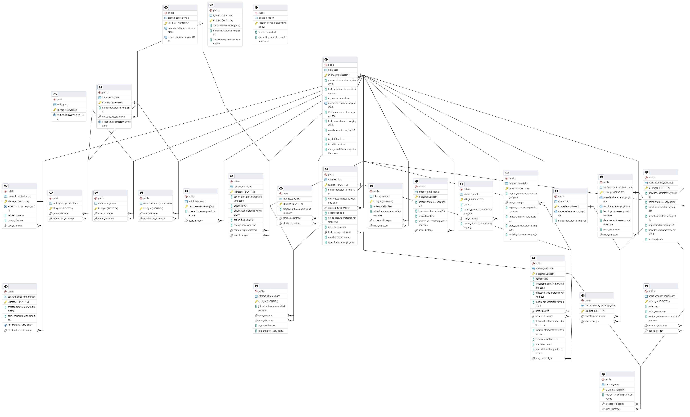

# Django-chat REST API backend.

# REST API

[live API](https://django-chat-z4za.onrender.com/swagger/)

# ERD PostgresSQL Database

## Environment variables.

### Django settings

SECRET_KEY='django secret key'

### Debug settings

DEBUG='value'

### Frontend settings

FRONTEND_URL='https://frontend.url'

### Backend settings

BACKEND_URL='htttps://backend.url'

### Database settings

DATABASE_NAME='database name'

DATABASE_USER='database username'

DATABASE_PASSWORD='database password'

DATABASE_HOST='database host url'

DATABASE_PORT='database port'

### Email settings

EMAIL_HOST='smtp.host.url'

EMAIL_PORT='587'

EMAIL_USE_TLS='True'

EMAIL_HOST_USER='email.username'

EMAIL_HOST_PASSWORD='email.password'
